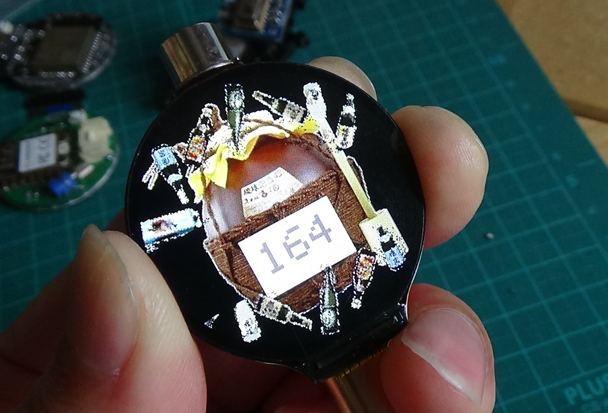
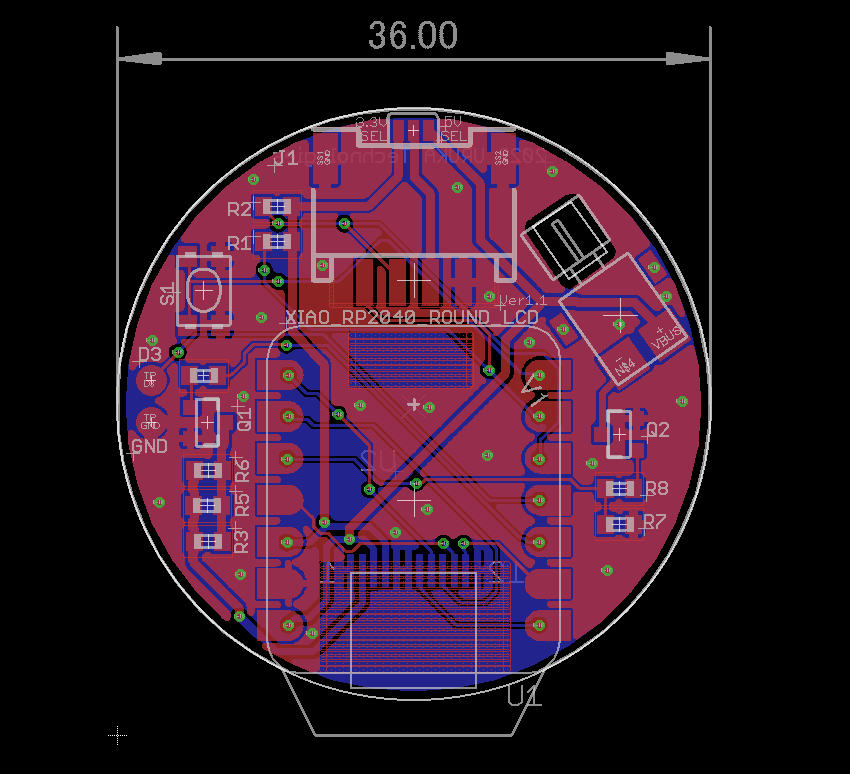
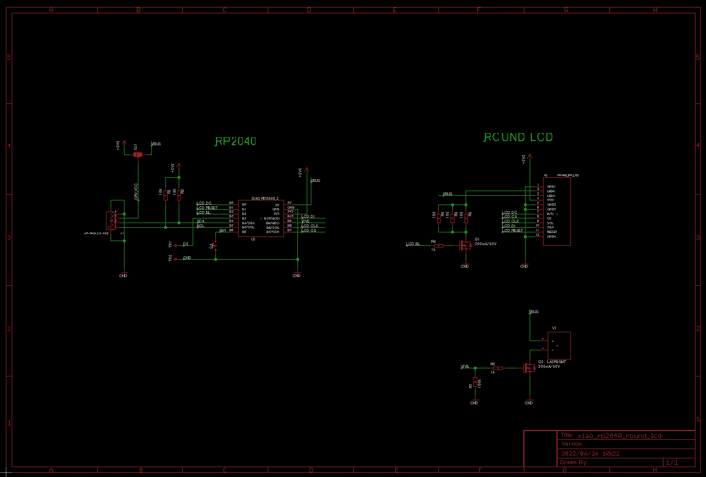

# ラウンド液晶モジュール for XIAO(現在準備中)

XIAO RP2040 (XIAO nRF52840でも動きました)を使用して1.28インチ240ｘ240ドットの円形液晶を駆動する基板モジュールです。

円形液晶の裏にXIAOを配置することで、とても小さくスリムな形状になりました。

円形液晶にはGC9A01というコントローラーが使用されていますが、対応したグラフィックライブラリが数種類公開されています。

本モジュールは「自分でSMT部品が実装できたり、グラフィックライブラリの使い方を理解して、うまく動かない場合でも自己解決をして液晶モジュールを駆動出来る人」をターゲットにしております。

# 形状および回路図

以下に外形イメージを示します

以下に回路図を示します

# ピンアサイン

M5Stamp とLCDの制御信号とのピン接続は以下となります。

- SCLK:IO2/D8
- MOSI:IO3/D10
- DC:IO26/D0
- CS:IO1/D7
- RST:IO27/D1
- バックライト:IO28/D2

基板上にタクトスイッチを１個実装しています

- SWポート：IO0/D6

また、I2C接続を想定したGROVEコネクタがあります

- 1PIN : SCL  IO7/D5　(I/F電圧レベルは3.3V)
- 2PIN : SDA  IO8/D4　(I/F電圧レベルは3.3V）
- 3PIN : VCC（5Vか3.3Vを選択可能）
- 4PIN : GND 

さらに小型FETを搭載して、アクチェータ１個を駆動する事が可能です

（こちらはについては、扱い方次第で不具合も発生しますので自己責任で実装してください）

- 制御ポート：IO4/D9

# 部品実装について

部品の実装（ハンダ付け方法）などについては、以下資料をご確認ください

https://github.com/urukakanko/XIAO_Round_LCD/blob/main/%E9%83%A8%E5%93%81%E5%AE%9F%E8%A3%85%E3%81%AE%E8%AA%AC%E6%98%8E.pdf

# 使用するツールやライブラリ

XIAO RP2040のArduinoやPythonの導入については以下をご確認ください

https://wiki.seeedstudio.com/XIAO-RP2040/

グラフィックライブラリについてはlovyan様のLovyanGFXにて動作確認をしています

https://github.com/lovyan03/LovyanGFX

他、GC9A01に対応したライブラリが使用可能と考えています。

なお、RP2040とGC9A01の組合せにてcircuit pythonでも動作する事を確認しています

# LCD表示動画

準備中

# 使用例

準備中

# 製作者

ウルカテクノロジー
Hiroyuki Sunagawa

https://www.facebook.com/URUKA-Technologies-105478404379918
