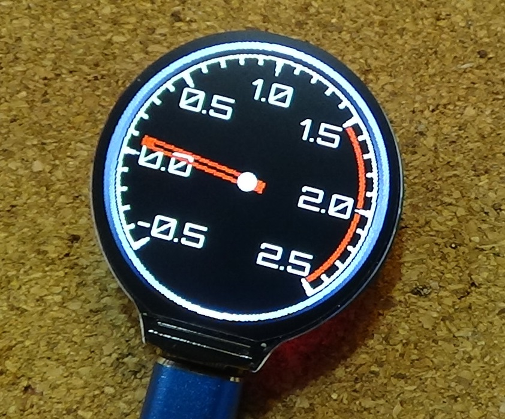
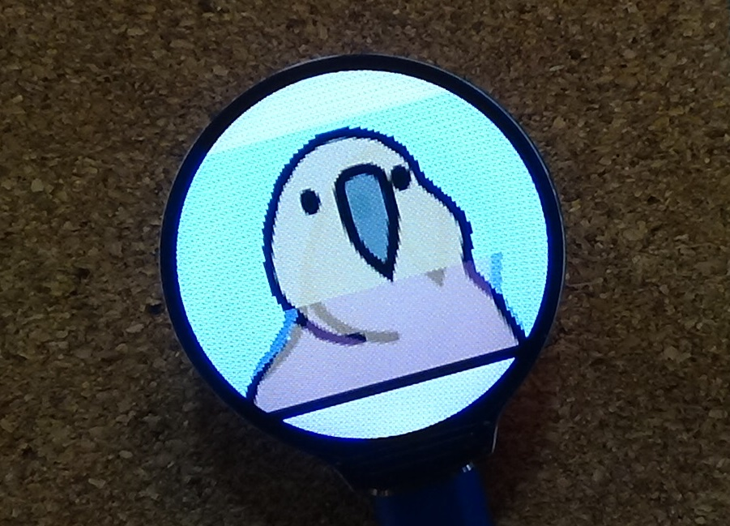

# ラウンド液晶モジュール for XIAO RP2040（組立キット）

写真は作例です

XIAO RP2040を使用して1.28インチ240ｘ240ドットの円形液晶を駆動する基板モジュールのキットです。

(XIAOシリーズでは、XIAO ESP32C3 や　nRF52840で液晶表示が出来る事を確認しています)

(なお、XIAO ESP32S3を実装する場合には懸念事項があります。以下ページで説明していますのでご参照下さい。)

https://github.com/urukakanko/XIAO_square_lcd

この製品はキットですので、ご自分で同梱の部品をハンダ付けしてください。

円形液晶の裏にXIAOを配置することで、とても小さくスリムな形状になりました。

円形液晶にはGC9A01というコントローラーが使用されていますが、対応したグラフィックライブラリが数種類公開されています。

本モジュールは「自分でSMT部品が実装できたり、グラフィックライブラリの使い方を理解して液晶モジュールを駆動出来る人」をターゲットにしております。

# 形状および回路図

以下に外形イメージを示します

以下に回路図を示します

# ピンアサイン

M5Stamp とLCDの制御信号とのピン接続は以下となります。

注意；IO番号はRP2040用です　ESP32C2では異なります

- SCLK:IO2/D8
- MOSI:IO3/D10
- DC:IO26/D0
- CS:IO1/D7
- RST:IO27/D1
- バックライト:IO28/D2　バックライトLEDのPIN設定は必ず行ってください。未設定だと端子がハイインピーダンスとなりバックライトが不安定になります。

基板上にタクトスイッチを１個実装しています

- SWポート：IO0/D6

また、I2C接続を想定したGROVEコネクタがあります

- 1PIN : SCL  IO7/D5　(I/F電圧レベルは3.3V)
- 2PIN : SDA  IO8/D4　(I/F電圧レベルは3.3V）
- 3PIN : VCC（5Vか3.3Vを選択可能）
- 4PIN : GND 

さらに小型FETを搭載すると、小型のバイブレーターなどアクチェータ１個を駆動する事が可能です

（こちらはについては扱い方次第で不具合も発生しますので、回路を読み解き自己責任で部品調達、実装してください）

- 制御ポート：IO4/D9

# 部品実装について

部品の実装（ハンダ付け方法）などについては、以下資料をご確認ください

https://github.com/urukakanko/XIAO_Round_LCD/blob/main/%E9%83%A8%E5%93%81%E5%AE%9F%E8%A3%85%E3%81%AE%E8%AA%AC%E6%98%8E.pdf

# 使用するツールやライブラリ

XIAO RP2040のArduinoやPythonの導入については以下をご確認ください

https://wiki.seeedstudio.com/XIAO-RP2040/

グラフィックライブラリについてはlovyan様のLovyanGFXにて動作確認をしています

https://github.com/lovyan03/LovyanGFX

他、GC9A01に対応したライブラリが使用可能と考えています。

なお、RP2040とGC9A01の組合せにてcircuit pythonでも動作する事を確認しています

# サンプルソース

LovyanGFXのスケッチの例より引用させて頂きました。

サンプルその１

https://github.com/urukakanko/XIAO_Round_LCD/tree/main/xiao2040_round_lcd_MeterSample

サンプルその２

https://github.com/urukakanko/XIAO_Round_LCD/tree/main/xiao2040_round_lcd_PartyParrot

サンプルその３

https://github.com/urukakanko/XIAO_Round_LCD/tree/main/xiao2040_round_clockSample

# そーたメイ様のつくるっちに対応して頂きました

ファームウェアは以下です

https://github.com/sohtamei/TuKuRutch.ext/blob/master/libraries/lovyanGFXpico/src/src.ino.uf2

ファームウェアを書込んでから、Cromeブラウザで以下にアクセスします　簡単なデモプログラムです「set config」ブロックにてROUNDXIAOを選択して下さい

https://sohta02.sakura.ne.jp/tukurutch/#000000531

# 表示例

# Shigezone様にて販売中です

https://www.shigezone.com/product/roundlcd1_28/?fbclid=IwAR3sltDdaBDT0KiREBcUj3ycjUr6qAAMGzQqQChrtsmQ8KoZGPFba8SgSaQ

# 製作者

ウルカテクノロジー
Hiroyuki Sunagawa

https://www.facebook.com/URUKA-Technologies-105478404379918
